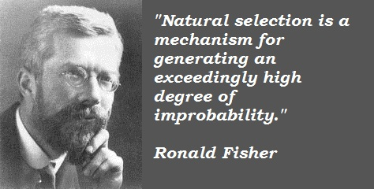
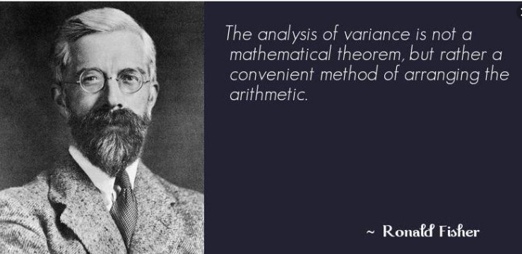

```{r include=FALSE}
knitr::opts_chunk$set(eval = FALSE)
knitr::opts_chunk$set(warning = FALSE)
knitr::opts_chunk$set(message = FALSE)
```

# Diseño de experimentos

## Ronald Fisher

```{r, echo=FALSE, eval = TRUE, fig.align = 'center', fig.cap='R. Fisher 1.', out.width="500"}

```

## Ronald Fisher

```{r, echo=FALSE, eval = TRUE, fig.align = 'center', fig.cap='R. Fisher 2.', out.width="500"}

```

## George Box 

```{r, echo=FALSE, eval = TRUE, fig.align = 'center', fig.cap='G. Box.', out.width="500"}

```

# Normalidad

## Q-Q Norm

```{r, eval = TRUE}
library(qqplotr)
library(dplyr)
iris %>% 
  ggplot(data = ., aes(sample = Sepal.Length)) +
  stat_qq_band() +
  stat_qq_line() +
  stat_qq_point() +
  labs(x = "Cuantiles teóricos", y = "Cuantiles muestrales")
```

## Histograma

```{r, eval = TRUE}
iris %>% 
  ggplot(data = ., aes(x = Sepal.Length)) +
  geom_histogram(color = "black", bins = 30, fill = "dodgerblue4") +
  theme_light() +
  labs(x = "Longitud del sépalo", y = "Frecuencia") +
  ggtitle("Histograma de longitud del sépalo")
```

## Densidad

```{r, eval = TRUE}
iris %>% 
  ggplot(data = ., aes(x = Sepal.Length)) +
  geom_density(fill = "dodgerblue4", color = "black", lwd = 0.7) +
  theme_light() +
  labs(x = "Longitud del sépalo", y = "Densidad") +
  ggtitle("Histograma de longitud del sépalo")
```

## Shapiro Wilk

```{r, eval = TRUE}
iris$Sepal.Length %>% 
  shapiro.test()
```

## Resumen

> - Gráfico cuantil cuantil
> - Histograma
> - Densidad
> - Test de *Shapiro Wilk*

# Secuencia de códigos

## `ggplot2`


<div class="fragment">
```{r}
library(ggplot2)                                 # Cargando biblioteca
```
</div>
<div class="fragment">
```{r}
g1 <- iris %>% 
  ggplot(data = ., aes(x = Sepal.Length))        # Primera capa
```
</div>
<div class="fragment">
```{r}
g1 <- g1 + geom_histogram()                      # Histograma
```
</div>
<div class="fragment">
```{r}
g1 <- g1 + labs(x = "Longitud del sépalo")       # Etiqueta del eje x        
```
</div>
<div class="fragment">
```{r}
g1 <- g1 + theme_light()                         # Cambiando el tema       
```
</div>
<div class="fragment">
```{r}
g1                                               # Imprimiento gráfico      
```
</div>

# ¡Gracias!

```{r, echo=FALSE, eval = TRUE, fig.align = 'center', out.width="500"}
knitr::include_graphics("img/thanks.gif")
```